# Task manager
## Что за проект
Реализация таск менеджера с возможностью добавлять задачи, отмечать их выполненными, убирать отметку об выполнении, изменять добавленные задачи, удалять их.
Задачи обладают следующими параметрами: название, дата дедлайна, теги (способ упорядочивать задачи, у задачи как может и не быть тегов вообще, так и быть сразу несколько), приоритет выполнения (чем он меньше тем задача важнее), и сложность задачи (чем она больше, тем задача сложнее).

## Основные окна
Всего у таск менеджера есть 3 окна, далее про содержимое и функционал каждого подробнее
### Основное окно

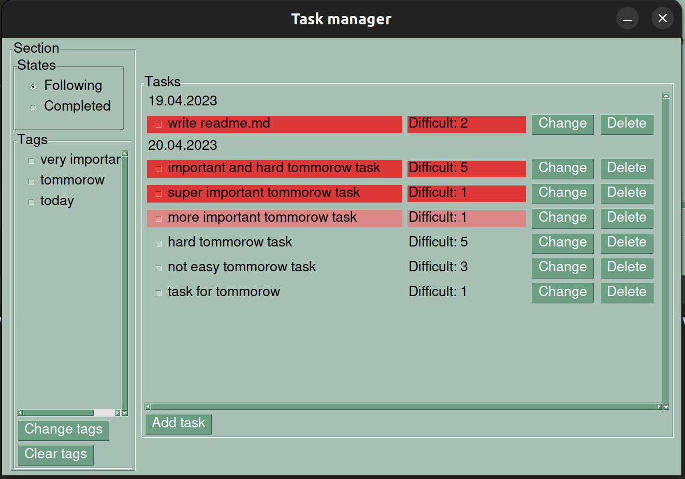

На основном окне отображаются задачи и настройки текущего раздела.
#### Текущий раздел
Слева настройки текущего раздела.
##### States
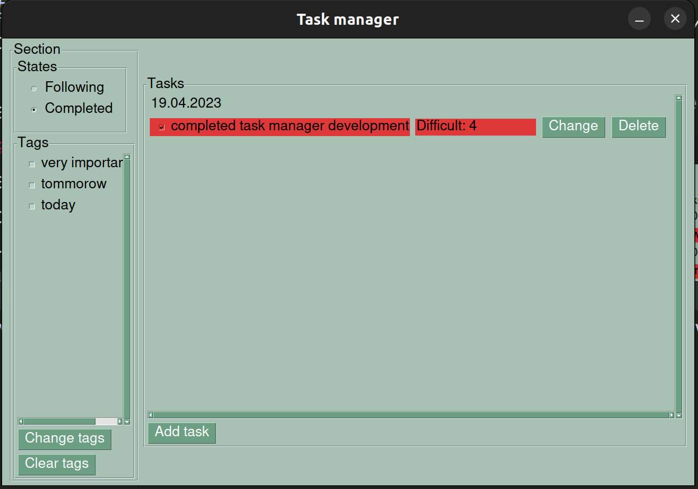
States - это состояния задач. Задачи могут быть
following - ожидающими выполнения и completed - выполненные.
При нажатии на состояние отображаются все задачи с соответствующим состоянием,
у которых есть текущие выбранные теги.
##### Tags
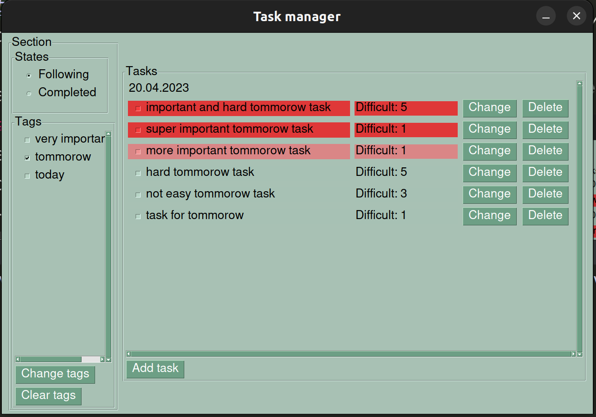
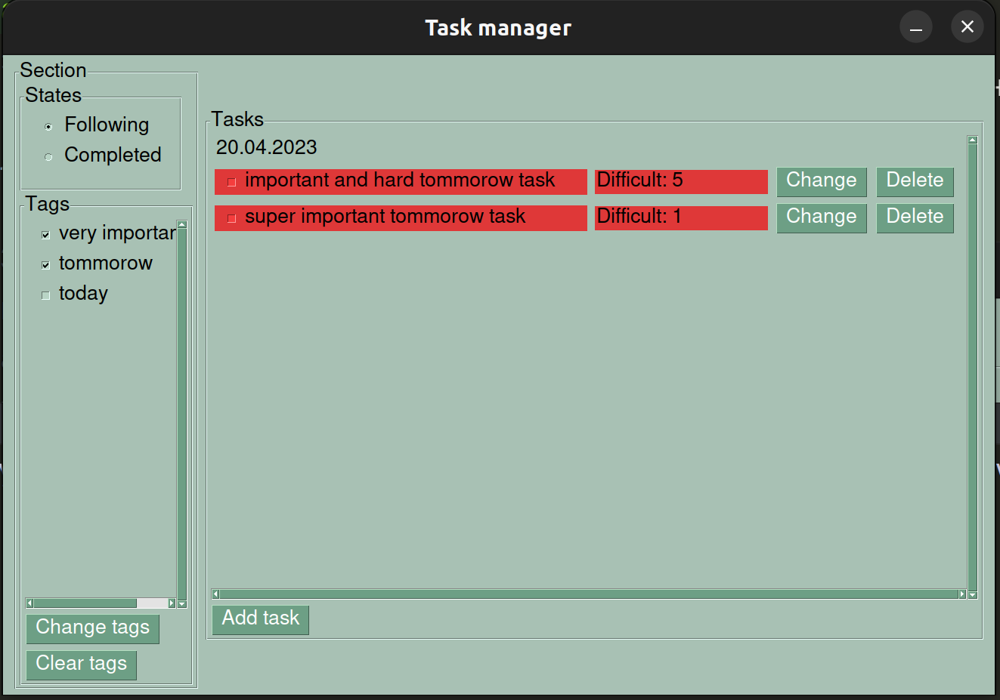
Tags - это все теги задач.
На экране отображаются только те задачи, у которых есть все выбранные теги.
Выбранными тегами считаются те, напротив которых стоят галочки.
Чтобы обновить страницу после того, как был изменён набор выбранных тегов 
нужно нажать Change tags.
Чтобы очистить набор выбранных тегов и сделать его пустым нужно нажать Clear 
tags
##### Tasks
Tasks - все задачи, у которых выбранное состояние (following/completed),
и обладающие как минимум всеми отмеченными тегами.
Перед блоком задач, у которых одинаковый дедлайн идёт сначала дата этого 
дедлайна. Внутри блока задачи упорядочены сначала по приоритету (по 
возрастанию), потом в порядке сложности (по убыванию).
Каждая задача записана 5 параметрами: 
* Название задачи
* Приоритет задачи. Отображается цветом:
  * Яркий красный - задача имеет высший приоритет,
  * Блеклый красный - у задачи средний приоритет,
  * Цвет совпадает с фоновым - у задачи низший приоритет.
* Сложность задачи. Соответствует указанной при её добавление (об этом позже).
* Кнопка Change. Открывает окно изменения этой задачи, об этом позже.
* Кнопка Delete. Удаляет эту задачу (безвозвратно и окончательно)
Нажатие на задачу в разделе с состоянием following отметит задачу 
  выполненной и добавит в раздел completed. Аналогично для раздела completed.
Кнопка Add task в конце списка задач открывает окно добавления задач. Об 
  этом в следующем разделе
#### Добавления/изменение задачи
У добавления и изменения задач практически одинаковые окна,
отличаются только значения по умолчанию при открытии, и название кнопки 
отправки результата. У окна изменения значения по умолчанию соответствуют 
значениям полей задачи, которую изменяют. Значения по умолчанию у окна 
добавления описано далее. Если любое окно просто закрыть, то изменения не 
будут применены.

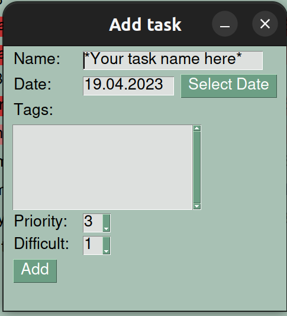

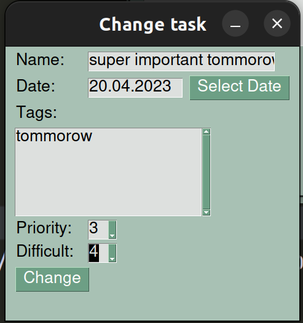
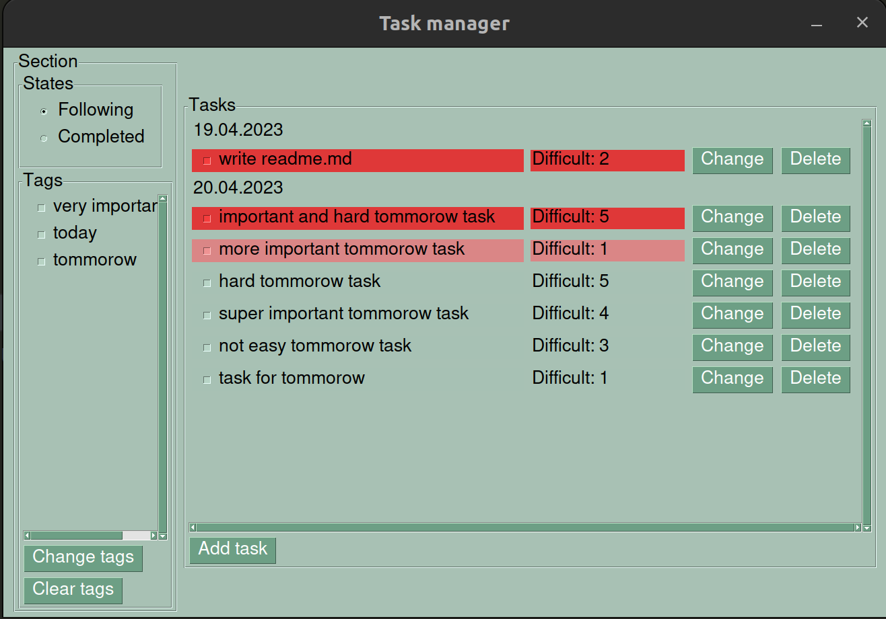
##### Поля и кнопки
* Name - название задачи, по умолчанию "*Your task name here". Не может быть 
пустым
* Date - дата дедлайна задачи, по умолчанию дата текущего дня. Не может 
быть пустым. Должна заполняться  в формате "%d.%m.%Y". Есть кнопка Select 
  Date позволяющая выбрать дату при помощи календаря.
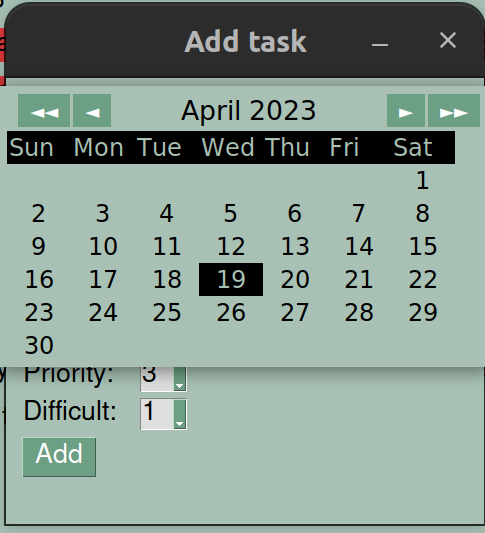
* Tags - теги задачи, по умолчанию пусто. Тег может быть любой строкой, каждый 
тег начинается с новой строки (теги разделяются переносом строки). Пустые 
теги (строки только из пробелов, табуляций и т.п.) - игнорируются
* Priority - приоритет задачи, по умолчанию 3. Не может быть пустым. Должен 
  быть целым числом из диапазона [1;3]
* Difficult - сложность задачи, по умолчанию 1. Не может быть пустым Должна 
  быть целым числом из диапазона [1:5]
* Кнопка Add (Change) добавляет (изменяет) задачу. Если задача добавляется, 
  то её состояние равно following. Если задача изменяется, то её состояние 
  совпадает с тем состоянием, что было до добавления. Если поля некорректно 
  заполнены, то сообщает об ошибке и даёт возможность её исправить
(описано далее). Если все поля заполнены корректно, но уже существует задача 
  с таким же названием и состоянием, то отображается предупреждение, если 
  после предупреждения снова нажать на кнопку, то задача добавится (изменится)
##### Ошибки
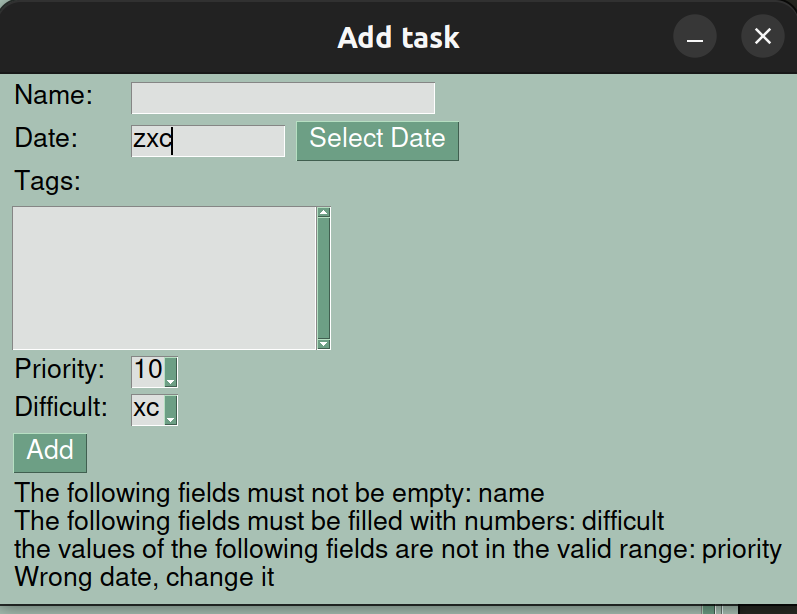
Ошибки бывают следующих типов:
* Не заполнены обязательные к заполнению поля
* Указана некорректная дата (не является датой, не верный формат)
* Значение поля, которое должно быть числом им не является
* Значение поля, которые должно лежать в определённом диапазоне не лежит в нём
##### Предупреждение
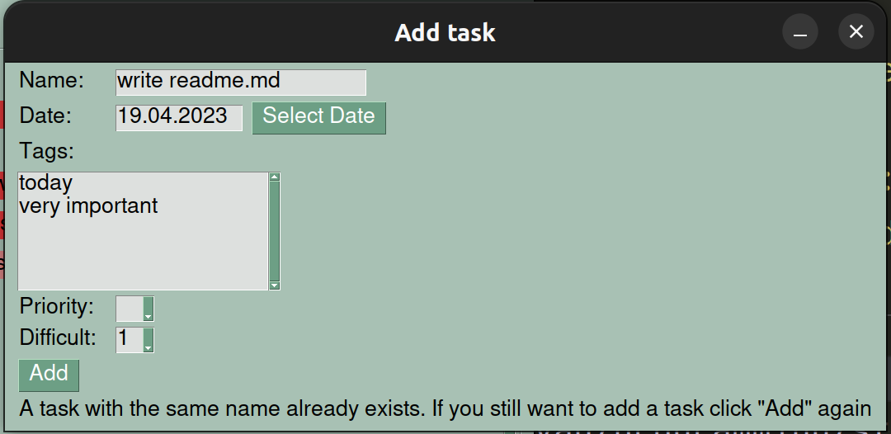
Предупреждение о том, что задача с таким состоянием и именем уже существует
##### Результаты работы
######  Add task

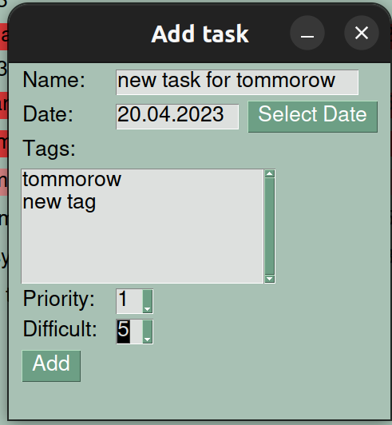
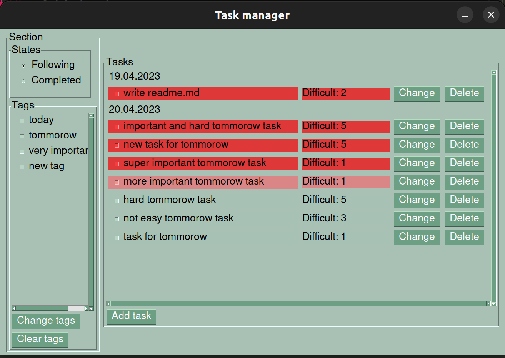
###### Change

